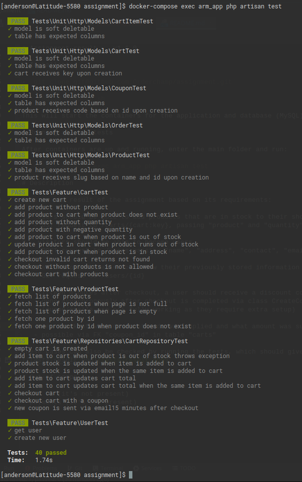

# Assignment result - _v1.1.0_

# Installation

- `git clone git@github.com:Orderchamp/assignment.git`
- `cd assignment`
- `./build-compose.sh`

This will start the (Docker) containers for the web application and database (MySQL).

# Running all the tests

After containers are up and running, enter the main folder and run:

- `docker-compose exec arm_app php artisan test`

# Description

This application was built using "API first" approach, and is the result of the assignment and its requirements:

1. _users should be able to add products that are in stock to their shopping cart_
    - if no product is not available in stock, item cannot be added
   - `POST` request to `/carts/{cart:key}`, with parameters `product` and `quantity`
   
2. _visitors should be able to become users_ 
    - basically, visitors can become users at any time, including at checkout time
    - `POST` request to `/users` passing `name`, `address`, `contact`, `email`, `password`, etc
    - P.S.: user authentication is not present, but it could be added via middleware
   
3. _users should be able to review their previously stored information (name, address, contact details)_
    - a simple request that returns the users details
   - `GET` request to `/users/{id}`
   
4. _fifteen minutes after checkout, a user should receive a discount code of € 5,-_
   - coupon is created and the email is sent asynchronously after checkout is completed, via class `CreateCouponAfterCheckout`
   - P.S.: emails are sent as queue & mail require extra setup

5. _keep track of what discount code was applied and what amount was subtracted from the checkout_
   - track and reporting is possible via the FK `coupon_id` in table `carts`

These use cases can also be validated by running the tests, which should give a result similar to the image below:

### Database schema:

# Out-of-scope

- the UI (it's not present)
- payments (it's not present)
